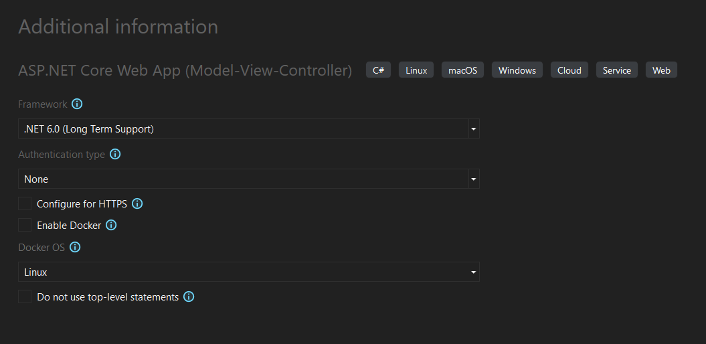
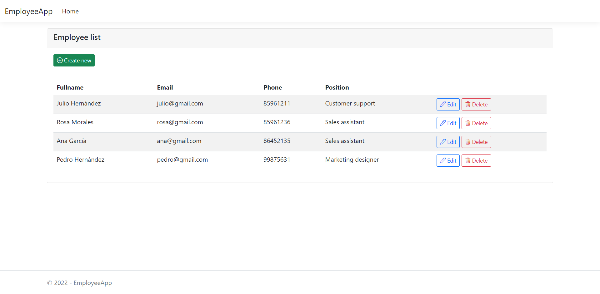
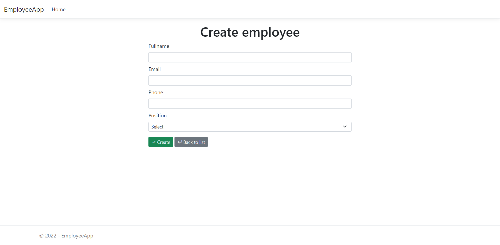
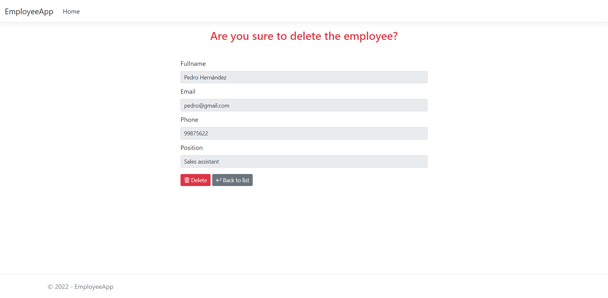
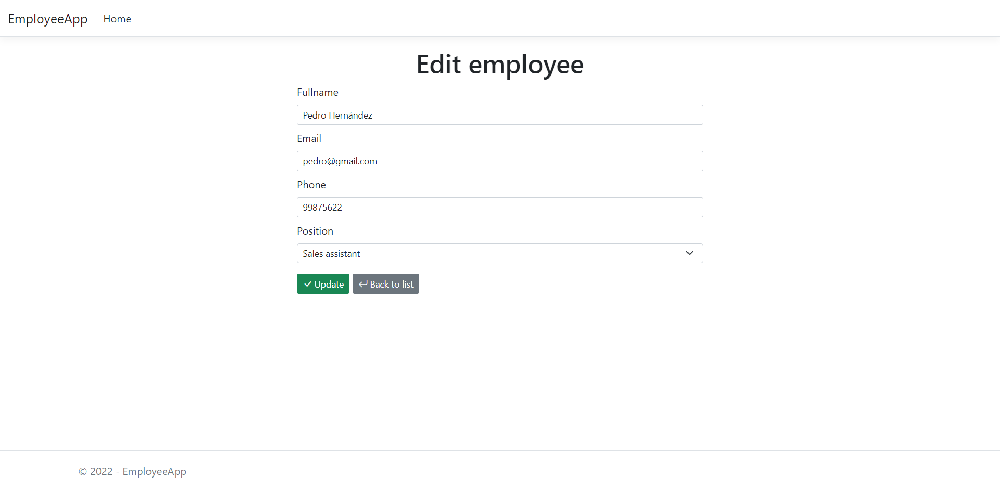

# Employee App

## Project type

## Complements

<table>
    <thead>
      <tr>
        <th>Name</th>
        <th>Version</th>
      </tr>
    </thead>
    <tbody>
      <tr>
        <td>Microsoft.EntityFrameworkCore.SqlServer</td>
        <td>6.0.4</td>
      </tr>
      <tr>
        <td>Microsoft.EntityFrameworkCore.Tools</td>
        <td>6.0.4</td>
      </tr>
    </tbody>
</table>

## App

### Employee list

### Create employee

### Delete employee

### Edit employee

